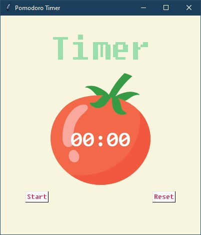
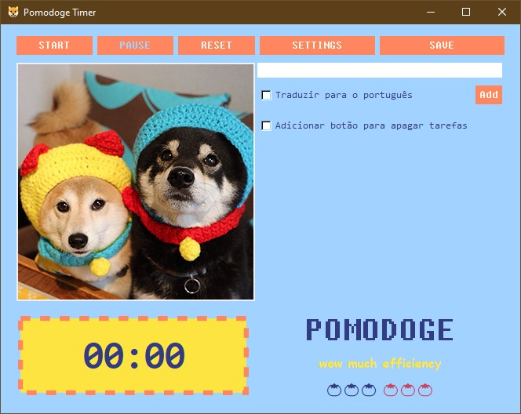

<h1 align="center">Pomodoge Timer</h1>

O método pomodoro é utilizado para auxiliar na gestão de produtividade, dividindo o nosso tempo de trabalho em ciclos de 25 minutos com pequenos intervalos de 5 minutos entre eles. Após a finalização do quarto ciclo de trabalho, tem-se uma pausa de 20 minutos, e a seguir o processo começa novamente.
Essa abordagem, intercalando períodos de foco total com intervalos, promove a concentração de forma sustentável, já que um dos seus objetivos é evitar a fadiga mental.

<h2 align="center"> 🍅 O programa 🍅 </h2>

O Pomodoge Timer foi criado a partir do projeto do dia 28 no bootcamp 100 Days of Code, da Dra. Angela Yu e pode ser acessado <a href="https://github.com/anamilanezi/py-practices/tree/main/100-days-of-code/d021-d030/projects/d28-pomodoro-timer" target="_blank">nesse link</a>. O programa é desenvolvido utilizando o pacote Tkinter e em sua versão inicial, ele apresentava os botões de "Start" e "Reset", uma contagem simples dos ciclos de trabalho e a troca do título de acordo com o ciclo atual.

A partir dessa base, com o avanço do bootcamp e as novas técnicas em Python adquiridas, passei a implementar outras funcionalidades ao longo dos dias, chegando a essa primeira versão que segue em aprimoramento.

### Algumas das melhorias já implementadas/em desenvolvimento:

<a href="en-us">[Inglês]</a>  | Português (em construção)

✅ Notificações sonoras a cada início de ciclo com o pacote Playsound.

✅ Ao finalizar os quatro ciclos de trabalho, ele exibe um tomate representando um ciclo "pomodoro" completo.

✅ Geração de um relatório no formato CSV com data, hora de início, minutos de trabalho completos, "pomodoros" completos e horário que as informações foram salvas.

✅ Personalização do tempo de duração cada ciclo.

✅ Botão de Pause/Resume que permite pausar e retomar a qualquer momento. 

✅ Correção do Bug que permitia apertar o botão de "Start" seguidamente, o que fazia com que o timer exibisse diferentes contagens ao mesmo tempo.

✅ Criação de uma lista de tarefas.

✅ Lista de imagens armazenadas localmente que se alternam de forma aleatória para o uso do programa offline ou quando ocorrer algum erro na chamada de algumas das APIs.

✅ Uso da API <a href="https://shibe.online/" target="_blank">shibe.doge</a> para geração de uma lista de imagens aleatórias que se altera a cada execução do programa, que por sua vez são redimensionadas através da <a href="https://www.abstractapi.com/" target="_blank">Abstract API</a> para se adequarem a disposição do programa. Cada novo ciclo de trabalho resulta na exibição de uma nova imagem - Adicionado em 16/08.

✅  Verificar se existe conexão com a internet para então utilizar imagens de API ou imagens offline, assim como verificar se limite de requisições da API não foi atingido (Abstract API possui um limite de dados para seu serviço de redimensionamento gratuíto) - Adicionado em 16/08.

⏳ Adicionar as tarefas do dia ao relatório gerado ao salvar.

⏳ Botão para a apagar as tarefas.

⏳ Opção de escolher entre imagens de cães e gatos para exibição.

